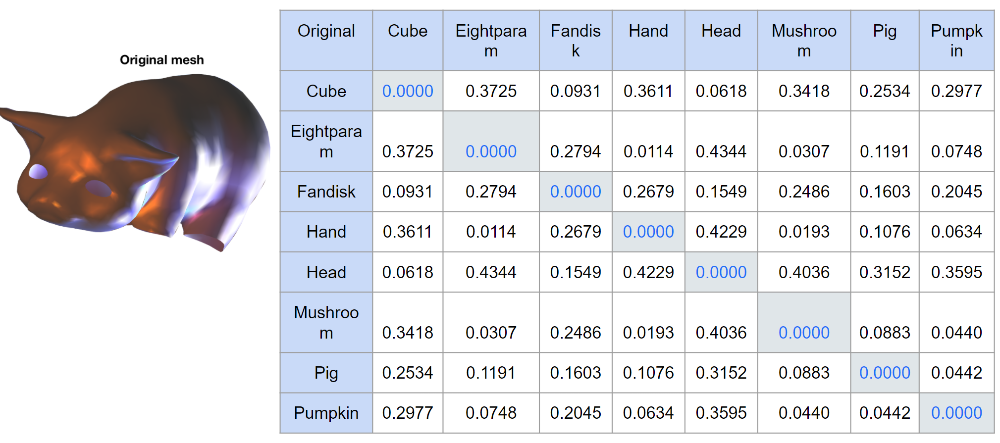
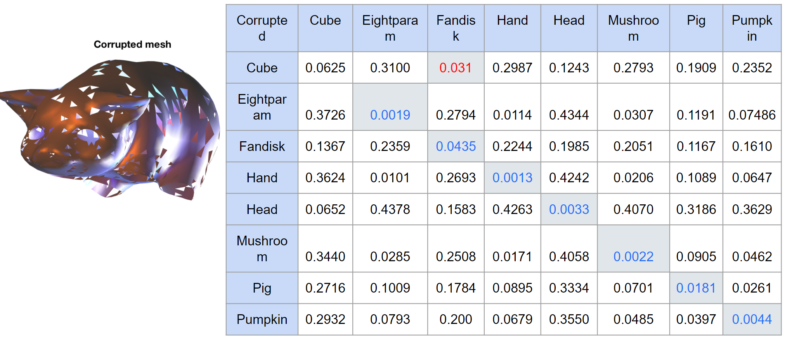
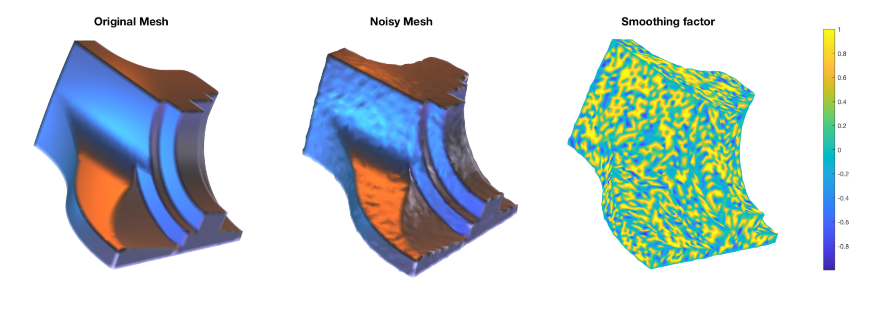
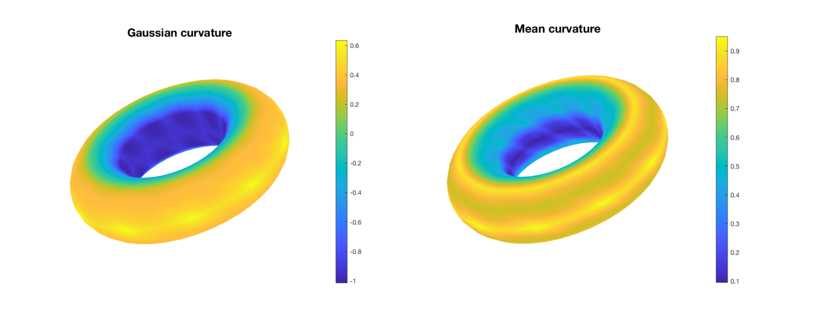
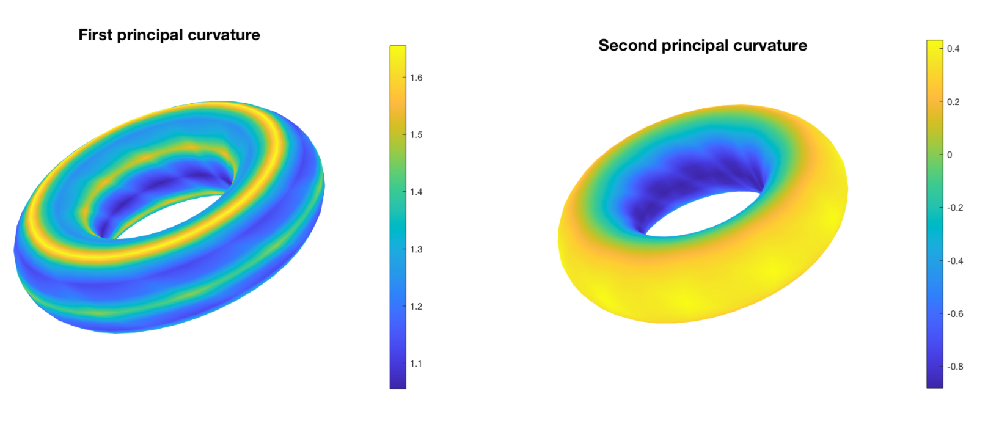

# Mesh Classification and Denoising using the Cotangents  Laplacian Operator [[PDF](report.pdf)]

The Mean, Gaussian and Principle components are based on "Discrete Differential-Geometry Operators
for Triangulated 2-Manifolds, Meyer et al"


## Mesh Classification

Classification of the mesh is done by binning the gaussian and mean curvature using a normalized histogram. The normalized histogram acts as the PDF and the Wasserstein distance is used to compute the closest match.


Clean                      |  Noisy 
:-------------------------:|:-------------------------:
  |  

## Denoising Mesh

The weights for anisotropic smoothing for feature-preserving denoising of a noisy mesh.

<p align="center">
</br>
</p>

## Curvatures 

### Mean and Gaussian Curvatures

<p align="center">
</br>
</p>


### Principle Components 

<p align="center">
</br>
</p>


## Demo

#### MATLAB

To evalute the algorithm in MATLAB run
```
main.m
```
located in src/matlab 


#### Python

To evalute the algorithm in Python run
```
python main.py
```
located in src/python 


## Acknowledgement

[DiffGeoOps](https://github.com/justachetan/DiffGeoOps)


## Citation

If you use this software in your work, please cite it using the following metadata.

 
 

```
@software{Millerdurai_meshclassification_2022,
author = {Millerdurai, Christen and Usón Peirón, Javier and Schichtel, Marco},
month = {02},
title = {{Mesh Classification and Denoising using the Cotangents Laplacian Operator}},
url = {https://github.com/Chris10M/mesh-feature-detection},
version = {1.0.0},
year = {2022}
}
```
